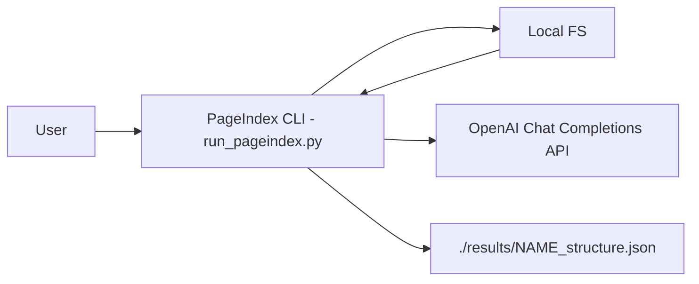
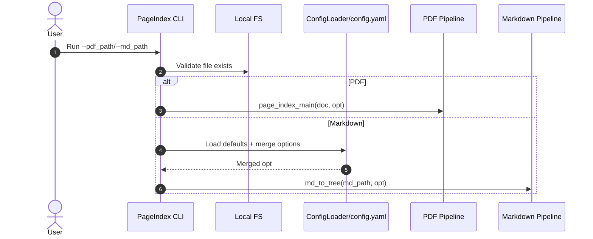
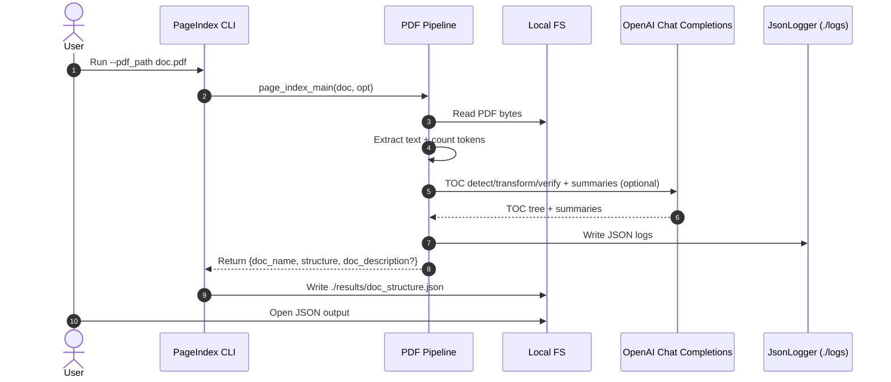
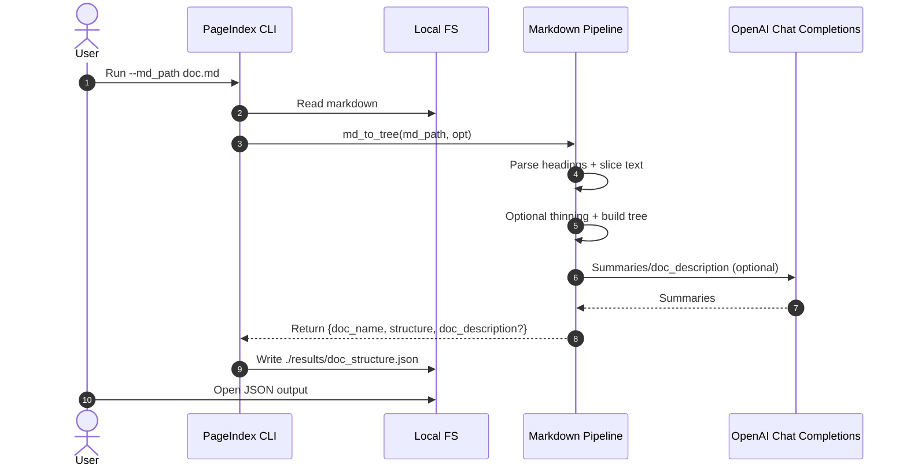
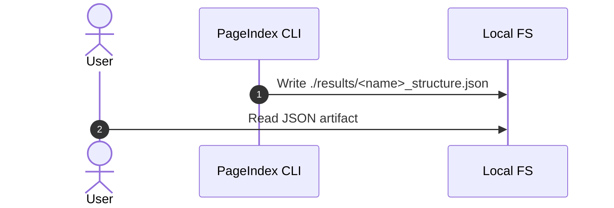
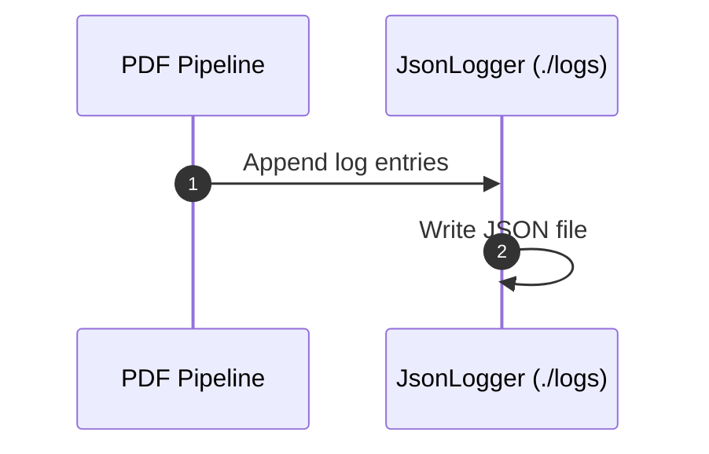
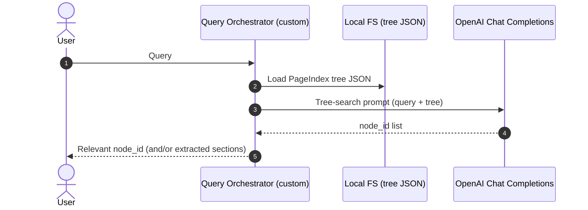
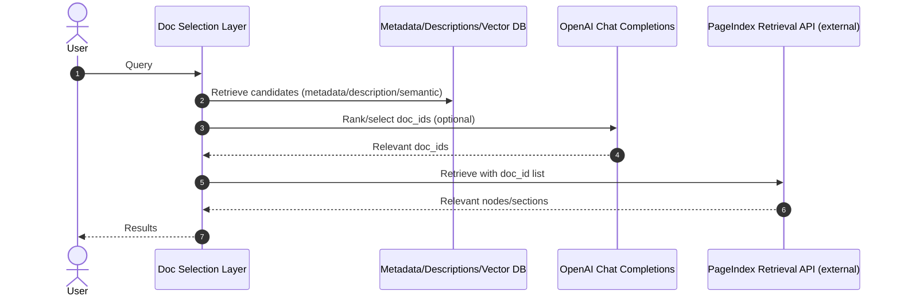

# Đánh giá kiến trúc — VectifyAI/PageIndex (Rà soát repo)

> **Đối tượng:** CTO / Tech Lead  
> **Vai trò:** Kiến trúc sư phần mềm cấp Principal & reviewer mã cấp doanh nghiệp  
> **Ghi chú phạm vi:** Đánh giá này dựa trên **bằng chứng trực tiếp từ các file repo có thể truy cập** trong phiên hiện tại.  
> **Ghi chú hiện trạng:** Đã truy xuất `pageindex/page_index.py` và `pageindex/config.yaml`; phần retrieval/tree search hiện nằm trong tài liệu hướng dẫn (`tutorials/`) và chưa thấy module retrieval riêng trong code.

---

## 0) Bắt đầu ngay: Entrypoint + Luồng chính end‑to‑end

### Điểm vào (CLI/script)

Repo hiện có một entrypoint chạy end‑to‑end theo kiểu local/self-host:

- **`run_pageindex.py`** — script CLI nhận `--pdf_path` hoặc `--md_path`, cấu hình options và xuất JSON tree ra filesystem (`./results/*.json`).  
  - **Bằng chứng:** `run_pageindex.py::__main__ (line 0)` — argparse, validate input, gọi `page_index_main(...)` (PDF) hoặc `md_to_tree(...)` (Markdown), rồi `json.dump(...)` ra `./results`.

### Luồng chính: PDF → cây PageIndex → JSON artifact

1. User chạy: `python3 run_pageindex.py --pdf_path /path/to/doc.pdf`  
2. Script parse args, build `opt` bằng `config(...)` (SimpleNamespace)  
3. Gọi `page_index_main(pdf_path, opt)` để tạo tree (implementation nằm trong `pageindex/page_index.py`)  
4. Lưu output JSON ra `./results/<pdf_name>_structure.json`

- **Bằng chứng:** `run_pageindex.py::__main__ (line 0)` — nhánh `if args.pdf_path:` tạo `opt = config(...)` và gọi `toc_with_page_number = page_index_main(args.pdf_path, opt)` rồi save JSON.

**Luồng nội bộ (theo `page_index_main`)**  

- Validate input (PDF path/BytesIO) + init `JsonLogger`, rồi build `page_list` bằng `get_page_tokens` (text + token count theo page).  
- `tree_parser` điều phối: `check_toc` → `meta_processor` (process_toc_with_page_numbers / process_toc_no_page_numbers / process_no_toc) → `verify_toc` + fix → `add_preface_if_needed` + `check_title_appearance_in_start_concurrent` → `post_processing` → `process_large_node_recursively`.  
- Post-processing theo flags: `write_node_id`, `add_node_text`, `generate_summaries_for_structure`, `generate_doc_description` (doc_description chỉ khi `if_add_node_summary == 'yes'`).  
- Trả về `{doc_name, (doc_description), structure}`.  
- **Bằng chứng:** `pageindex/page_index.py:1021`, `pageindex/page_index.py:1058`, `pageindex/page_index.py:1083`, `pageindex/utils.py:309`.

### Luồng chính: Markdown → tree → (tuỳ chọn) summaries → JSON artifact

1. User chạy: `python3 run_pageindex.py --md_path /path/to/doc.md`  
2. Script dùng `ConfigLoader` để nạp default config từ `pageindex/config.yaml` và merge với args  
3. Gọi `asyncio.run(md_to_tree(...))` để:
   - Parse headings `#..######` (bỏ qua code blocks ```…```)
   - Cắt text theo vùng heading
   - (optional) thinning dựa trên token count
   - Build tree (node_id được gán ở `build_tree_from_nodes`; nếu `if_add_node_id == 'yes'` thì ghi lại bằng `write_node_id`)
   - (optional) generate summary cho từng node (async gather)
   - (optional) generate doc_description (chỉ khi `if_add_node_summary == 'yes'`)
4. Lưu output JSON ra `./results/<md_name>_structure.json`

- **Bằng chứng:**  
  - `run_pageindex.py::__main__ (line 0)` — nhánh `elif args.md_path:` gọi `ConfigLoader().load(user_opt)` và `asyncio.run(md_to_tree(...))`, sau đó `json.dump(... ensure_ascii=False)` ra `./results`.  
  - `pageindex/utils.py:681`, `pageindex/config.yaml:1` — `ConfigLoader` load defaults từ `config.yaml`.  
  - `pageindex/page_index_md.py:190`, `pageindex/page_index_md.py:261` — build tree + node_id handling.  
  - `pageindex/page_index_md.py:266` — summary + doc_description gating; `md_to_tree` return schema `{doc_name, (doc_description), structure}`.

---

## 1) 8–12 file quan trọng nhất nên đọc trước (triage list)

1. `run_pageindex.py` — điểm vào CLI & điều phối (nhánh PDF/MD).  
   - **Bằng chứng:** `run_pageindex.py::__main__ (line 0)`
2. `pageindex/__init__.py` — bề mặt API public (re-export).  
   - **Bằng chứng:** `pageindex/__init__.py (line 0)`
3. `pageindex/page_index.py` — **pipeline PDF lõi** (TOC detection/transform/verify + tree build + summaries).  
   - **Bằng chứng:** `pageindex/page_index.py:1058` (`page_index_main`), `pageindex/page_index.py:1021` (`tree_parser`)
4. `pageindex/page_index_md.py` — pipeline Markdown (build tree + thinning + summaries).  
   - **Bằng chứng:** `pageindex/page_index_md.py::md_to_tree (line 0)`
5. `pageindex/utils.py` — wrapper LLM, đếm token, trích xuất text PDF, JSON helpers, traversal helpers, config loader (tham chiếu).  
   - **Bằng chứng:** `pageindex/utils.py::ChatGPT_API* (line 0)`
6. `pageindex/config.yaml` — config defaults (model, toc_check_page_num, max_page_num_each_node, ...).  
   - **Bằng chứng:** `pageindex/config.yaml:1`
7. `requirements.txt` — bề mặt dependency & mức độ pin phiên bản.  
   - **Bằng chứng:** `README.md (lines 25–27)` hướng dẫn install từ `requirements.txt`
8. `tests/` — fixtures (PDF/MD) + expected outputs (nếu có) để hiểu schema & determinism.  
   - **Bằng chứng:** `README.md (lines 22–24)` trỏ đến `tests/pdfs` và `tests/results`
9. `cookbook/*.ipynb` — usage patterns, expected workflow.  
   - **Bằng chứng:** `README.md (lines 20–21)` link notebooks
10. `tutorials/` — có hướng dẫn retrieval/tree search (prompt mẫu).  
    - **Bằng chứng:** `tutorials/tree-search/README.md:1`
11. `CHANGELOG.md` — lịch sử thay đổi & breaking changes.  
    - **Bằng chứng:** Repo structure hiển thị có `CHANGELOG.md`
12. `LICENSE` — compliance.  
    - **Bằng chứng:** Repo structure hiển thị có `LICENSE` (MIT)

---

## 2) Báo cáo đánh giá kiến trúc

## 2.1 Tóm tắt điều hành (10–15 dòng)

- Repo cung cấp **local/self-host CLI pipeline** để tạo **PageIndex tree** từ **PDF** hoặc **Markdown**, xuất artifact JSON ra filesystem (`./results`).  
  - **Bằng chứng:** `run_pageindex.py::__main__ (line 0)`
- **LLM dependency là trung tâm**: wrapper gọi `openai.OpenAI().chat.completions.create(...)` với `temperature=0`, retry đơn giản và không có schema validation/caching mặc định.  
  - **Bằng chứng:** `pageindex/utils.py::ChatGPT_API (line 0)`
- **Architecture hiện nghiêng về “script + utils module”**: nhiều wildcard import/export (`import *`) làm tăng coupling, khó test, khó kiểm soát API boundary.  
  - **Bằng chứng:** `run_pageindex.py (line 0)`, `pageindex/__init__.py (line 0)`, `pageindex/page_index_md.py (line 0)`
- Nhánh Markdown pipeline có cơ chế **async summary generation** bằng `asyncio.gather` trên toàn bộ node list, nhưng **không có concurrency limit/rate-limit**, tiềm ẩn rủi ro cost/rate-limit.  
  - **Bằng chứng:** `pageindex/page_index_md.py::generate_summaries_for_structure_md (line 0)`
- Secret handling dựa vào `.env` và env var `CHATGPT_API_KEY`; `load_dotenv()` chạy ngay khi import `utils.py` → side effect.  
  - **Bằng chứng:** `README.md (lines 25–27)`, `pageindex/utils.py (line 0)`
- Reliability: wrapper LLM trả về `"Error"` string sau max retries (và có return type không nhất quán giữa hàm), rủi ro “silent failure” lan truyền vào pipeline/output.  
  - **Bằng chứng:** `pageindex/utils.py::ChatGPT_API (line 0)`, `pageindex/utils.py::ChatGPT_API_with_finish_reason (line 0)`
- Observability cơ bản: có `JsonLogger` ghi JSON log ra `./logs`, nhưng vẫn thiếu structured logging/metrics/timing per stage; CLI vẫn dùng `print(...)`.  
  - **Bằng chứng:** `pageindex/utils.py:309`, `pageindex/page_index.py:1058`, `run_pageindex.py (line 0)`
- Testing/CI: repo có `tests/` nhưng chưa đánh giá được mức coverage và loại test do hạn chế truy xuất nội dung.  
  - **Bằng chứng:** `README.md (lines 22–24)`
- Điểm cần ưu tiên: (1) làm rõ boundary & public API, (2) harden LLM layer (prompt-injection, caching, output validation, backoff), (3) kiểm soát concurrency/cost, (4) nâng observability & testability.

---

## 2.2 Tổng quan hệ thống (mục tiêu, phạm vi, giả định)

### Mục tiêu hệ thống (theo repo & code truy xuất)

- Generate **tree-structured document index** từ PDF/Markdown, phục vụ reasoning-based retrieval (mô tả ở README).  
  - **Bằng chứng:** `README.md (lines 12–16, 22–29)`, `run_pageindex.py (line 0)`

### Phạm vi đánh giá (đã đọc/đã có bằng chứng trực tiếp)

- Entrypoint & orchestration: `run_pageindex.py`  
- PDF indexing path: `pageindex/page_index.py`  
- Markdown indexing path: `pageindex/page_index_md.py`  
- LLM wrappers + token utilities + PDF text extraction helpers (một phần): `pageindex/utils.py`  
- Config defaults & loader: `pageindex/config.yaml`, `ConfigLoader`  
- Public API surface: `pageindex/__init__.py`  
- Repo usage & options: `README.md`

### Assumptions (được user cung cấp)

- Repo là framework/pipeline xử lý tài liệu để tạo “PageIndex tree” và hỗ trợ reasoning-based retrieval.

### Giới hạn còn lại (ảnh hưởng đến độ sâu phân tích)

- Retrieval/tree search có tài liệu hướng dẫn trong `tutorials/tree-search/README.md` (prompt mẫu), nhưng chưa thấy module/entrypoint retrieval trong code Python.  
  - **Bằng chứng:** `tutorials/tree-search/README.md:1`
- Chưa đọc sâu notebooks `cookbook/` và tài liệu `tutorials/doc-search/*` (chỉ xác minh tồn tại).  
  - **Bằng chứng:** `cookbook/README.md:1`, `tutorials/doc-search/README.md:1`
- Chưa đọc chi tiết nội dung `tests/` (chỉ xác minh cấu trúc thư mục).  
  - **Bằng chứng:** `README.md (lines 22–24)`

---

## 2.3 Sơ đồ kiến trúc (C4 Container/Component)

### C4 — Góc nhìn Container (text)

- **Container A: Tiến trình PageIndex CLI (Python)**  
  - Chạy local, đọc input PDF/MD từ filesystem.  
  - Gọi **OpenAI Chat Completions API** qua `openai` SDK cho TOC detection/transform/verification và summaries/doc_description (PDF + MD).  
  - Ghi JSON artifacts ra filesystem (`./results`).  
  - Ghi log JSON per run ra `./logs` qua `JsonLogger`.  
  - **Bằng chứng:** `run_pageindex.py (line 0)`, `pageindex/page_index.py:1058`, `pageindex/utils.py (line 0)`, `pageindex/utils.py:309`

- **Hệ thống ngoài: OpenAI API**  
  - Được gọi qua `openai.OpenAI(...).chat.completions.create(...)`.  
  - **Bằng chứng:** `pageindex/utils.py::ChatGPT_API (line 0)`

- **Kho dữ liệu: Filesystem local**  
  - Input: PDF/MD path  
  - Output: `./results/<name>_structure.json`  
  - Logs: `./logs/*.json` (JsonLogger)  
  - **Bằng chứng:** `run_pageindex.py (line 0)`, `pageindex/utils.py:309`

### Mermaid — Góc nhìn Container



### C4 — Góc nhìn Component (trong tiến trình CLI)

**Các component có bằng chứng trực tiếp:**

1. **CLI Orchestrator**: parse args, validation, rẽ nhánh PDF/MD  
   - **Bằng chứng:** `run_pageindex.py::__main__ (line 0)`
2. **PDF Index Builder**: `page_index_main` → `tree_parser` → TOC detection/transform/verify → `post_processing` → recursive split; optional summaries/doc_description  
   - **Bằng chứng:** `pageindex/page_index.py:1058`, `pageindex/page_index.py:1021`
3. **Markdown Tree Builder**: parse heading, build tree, thinning, sinh summary  
   - **Bằng chứng:** `pageindex/page_index_md.py::md_to_tree (line 0)`
4. **LLM Client Wrapper**: gọi OpenAI chat sync & async + retry  
   - **Bằng chứng:** `pageindex/utils.py::ChatGPT_API`, `ChatGPT_API_async`, `ChatGPT_API_with_finish_reason (line 0)`
5. **Token Utilities**: đếm token qua `tiktoken.encoding_for_model`  
   - **Bằng chứng:** `pageindex/utils.py::count_tokens (line 0)`
6. **PDF Text Extraction Helpers**: `PyPDF2.PdfReader`, `page.extract_text()`  
   - **Bằng chứng:** `pageindex/utils.py::extract_text_from_pdf`, `get_text_of_pages (line 0)`
7. **Tree Traversal Helpers**: `structure_to_list`, `write_node_id`, leaf utilities  
   - **Bằng chứng:** `pageindex/utils.py::structure_to_list`, `write_node_id`, `get_leaf_nodes (line 0)`
8. **Config Loader + Defaults**: `ConfigLoader` + `config.yaml`  
   - **Bằng chứng:** `pageindex/utils.py:681`, `pageindex/config.yaml:1`
9. **JsonLogger**: ghi log JSON per run  
   - **Bằng chứng:** `pageindex/utils.py:309`

---

## 2.4 Luồng chính (build index; retrieval/query; error flows)

### 2.4.1 Luồng tạo chỉ mục — PDF

**Luồng (theo code):**

1. Validate PDF path/BytesIO, init `JsonLogger`  
2. Build `page_list` bằng `get_page_tokens` (text + token per page)  
3. `tree_parser`: `check_toc` → `meta_processor` (process_toc_with_page_numbers / process_toc_no_page_numbers / process_no_toc) → `verify_toc` + fix → `add_preface_if_needed` + `check_title_appearance_in_start_concurrent` → `post_processing` → `process_large_node_recursively`  
4. Post-processing theo flags: `write_node_id`, `add_node_text`, `generate_summaries_for_structure`, `generate_doc_description` (doc_description chỉ khi summary bật)  
5. Save JSON to `./results/<pdf>_structure.json`

- **Bằng chứng:** `run_pageindex.py::__main__ (line 0)`, `pageindex/page_index.py:1021`, `pageindex/page_index.py:1058`, `pageindex/page_index.py:1083`

### 2.4.2 Luồng tạo chỉ mục — Markdown

**Luồng (đã biết & có code):**

1. Read markdown file (`utf-8`)  
2. Extract headings, bỏ qua fenced code blocks  
3. Build node list: `{title, level, line_num, text}`  
4. Optional thinning: compute token count cho node + descendants; merge nodes dưới ngưỡng  
5. Build tree (stack-based; `node_id` gán ở `build_tree_from_nodes` và có thể ghi lại bằng `write_node_id` nếu `if_add_node_id == 'yes'`)  
6. Optional: generate summaries (async gather)  
   - leaf: `summary`  
   - non-leaf: `prefix_summary`  
7. Optional: remove `text` field nếu không yêu cầu  
8. Optional: generate `doc_description` (chỉ khi `if_add_node_summary == 'yes'`)  
9. Return `{doc_name, (doc_description), structure}`

- **Bằng chứng:**  
  - `pageindex/page_index_md.py::extract_nodes_from_markdown (line 0)` — regex headers + toggle code block  
  - `pageindex/page_index_md.py::extract_node_text_content (line 0)` — slice markdown_lines theo line_num  
  - `pageindex/page_index_md.py::tree_thinning_for_index (line 0)` — merge children nếu token < threshold  
  - `pageindex/page_index_md.py::build_tree_from_nodes (line 0)` — stack-based build  
  - `pageindex/page_index_md.py::generate_summaries_for_structure_md (line 0)` — `asyncio.gather` summaries  
  - `pageindex/page_index_md.py::md_to_tree (line 0)` — orchestration + format_structure + return schema

### 2.4.3 Luồng truy vấn / tìm kiếm

- **Có hướng dẫn ở tài liệu, chưa thấy module code.**  
  Retrieval/tree search được mô tả dưới dạng prompt mẫu trong `tutorials/tree-search/README.md`, nhưng không có entrypoint/module retrieval trong code Python hiện tại.
  - **Bằng chứng:** `tutorials/tree-search/README.md:1`, `README.md (lines 12–16)`

### 2.4.4 Luồng lỗi (những gì thấy trực tiếp)

1. **Input validation errors** → raise `ValueError` (fail fast)  
   - **Bằng chứng:** `run_pageindex.py::__main__ (line 0)` — validate pdf/md, file exists, mutually exclusive args
2. **OpenAI API failures** → retry 10 lần, mỗi lần sleep 1s; sau đó trả `"Error"` (string) thay vì raise  
   - **Bằng chứng:** `pageindex/utils.py::ChatGPT_API (line 0)`, `ChatGPT_API_async (line 0)`
3. **LLM output quá dài** (`finish_reason == "length"`) → `ChatGPT_API_with_finish_reason` trả `(content, "max_output_reached")`  
   - **Bằng chứng:** `pageindex/utils.py::ChatGPT_API_with_finish_reason (line 0)`

---

## 2.5 Bản đồ module & phụ thuộc (bảng)

| Module/Path | Vai trò | Phụ thuộc vào (inbound) | Phụ thuộc ra (outbound) | Ký hiệu chính (bằng chứng) |
|---|---|---|---|---|
| `run_pageindex.py` | Điều phối CLI, validate input, chạy pipeline PDF/MD, ghi output JSON | user CLI | `pageindex` (`import *`), `pageindex.page_index_md.md_to_tree`, `pageindex.utils.ConfigLoader`, `asyncio`, `json`, FS | `__main__ (line 0)` |
| `pageindex/__init__.py` | Bề mặt API public: re-export | `run_pageindex.py` | `.page_index`, `.page_index_md` | `from .page_index import *` / `md_to_tree (line 0)` |
| `pageindex/page_index_md.py` | Markdown → nodes → tree; optional thinning; optional summaries/doc_description | `run_pageindex.py` | `.utils` qua `import *`, `asyncio`, `re`, `os` | `md_to_tree`, `build_tree_from_nodes`, `tree_thinning_for_index`, `generate_summaries_for_structure_md (line 0)` |
| `pageindex/utils.py` | Wrapper LLM (OpenAI), token counting (tiktoken), PDF text extraction (PyPDF2), JSON extraction, tree traversal helpers, `JsonLogger` | `page_index_md.py`, `run_pageindex.py` | `openai`, `tiktoken`, `dotenv`, `PyPDF2`, `yaml`, `asyncio`, v.v. | `ChatGPT_API`, `ChatGPT_API_async`, `count_tokens`, `extract_text_from_pdf`, `structure_to_list`, `write_node_id (line 0)` |
| `pageindex/page_index.py` | PDF indexing core (TOC detect/transform/verify, tree build, summaries) | `run_pageindex.py` (calls) + `__init__.py` re-export | `.utils`, `asyncio`, `concurrent.futures`, `json`, `math`, `random`, `re` | `page_index_main` (`pageindex/page_index.py:1058`) |
| `pageindex/config.yaml` | Default config values | `ConfigLoader.load` | N/A | `pageindex/config.yaml:1` |
| `tests/` | Fixtures + expected outputs | N/A | N/A | Referenced in README |
| `cookbook/`, `tutorials/` | Ví dụ & hướng dẫn (tree-search/doc-search) | N/A | N/A | `tutorials/tree-search/README.md:1`, `tutorials/doc-search/README.md:1` |

---

## 2.6 Đánh giá thuộc tính chất lượng

### 2.6.1 Hiệu năng

**Hiện trạng (dựa trên bằng chứng):**

- Markdown summary generation tạo **task cho mọi node** và chạy `asyncio.gather` không giới hạn → nguy cơ bắn quá nhiều request song song (rate-limit, latency spikes).  
  - **Bằng chứng:** `pageindex/page_index_md.py::generate_summaries_for_structure_md (line 0)` — `tasks = [...]` + `await asyncio.gather(*tasks)`
- PDF pipeline cũng dùng nhiều `asyncio.gather` (check/verify/fix TOC, recursive split) **không có concurrency limit**.  
  - **Bằng chứng:** `pageindex/page_index.py:92`, `pageindex/page_index.py:834`, `pageindex/page_index.py:1017`
- Thinning và token count có pattern “scan forward for children” cho từng node → worst-case **O(n²)** theo số heading nodes.  
  - **Bằng chứng:** `pageindex/page_index_md.py::update_node_list_with_text_token_count.find_all_children` + vòng lặp over nodes (line 0)
- Token counting dùng `tiktoken.encoding_for_model(model)` và encode toàn bộ text → cost theo O(token_count).  
  - **Bằng chứng:** `pageindex/utils.py::count_tokens (line 0)`

**Rủi ro:**

- Với Markdown dài (n nodes lớn), concurrency + O(n²) thinning có thể gây chậm/timeout hoặc vượt rate limit OpenAI.
- Với PDF, các bước LLM song song không giới hạn có thể gây rate-limit/cost spike, đặc biệt khi tài liệu dài.

**Đề xuất (actionable):**

1. **Giới hạn concurrency cho async LLM calls** bằng `asyncio.Semaphore` + batch scheduling.  
   - Target: `pageindex/page_index_md.py::generate_summaries_for_structure_md`, `pageindex/page_index.py` (check/verify/fix TOC, recursive split)  
   - Effort: **S** | Risk: Low | Impact: High  
   - Bằng chứng: `asyncio.gather` không giới hạn (line 0)
2. **Thêm caching** theo hash(prompt+model+version) (filesystem cache) để tránh gọi lại khi rerun.  
   - Target: `pageindex/utils.py::ChatGPT_API*` và callers  
   - Effort: **M** | Risk: Medium | Impact: High  
   - Bằng chứng: không có caching trong wrappers (line 0)
3. **Tối ưu thinning**: thay scan-forward nhiều lần bằng precomputed parent/child relations (stack pass) để về O(n).  
   - Target: `pageindex/page_index_md.py::update_node_list_with_text_token_count`, `tree_thinning_for_index`  
   - Effort: **M** | Risk: Medium | Impact: Medium/High  
   - Bằng chứng: find_all_children scan forward per node (line 0)

### 2.6.2 Độ tin cậy

**Hiện trạng:**

- Retry LLM: `max_retries=10`, sleep 1s, không exponential backoff, không phân loại lỗi (429/5xx), và **không raise** sau khi fail mà trả `"Error"`.  
  - **Bằng chứng:** `pageindex/utils.py::ChatGPT_API (line 0)`, `ChatGPT_API_async (line 0)`
- `ChatGPT_API_with_finish_reason` có **return type không nhất quán**: thường trả tuple `(content, status)` nhưng error path trả `"Error"` string.  
  - **Bằng chứng:** `pageindex/utils.py::ChatGPT_API_with_finish_reason (line 0)`
- CLI fail fast cho input sai (điểm tốt).  
  - **Bằng chứng:** `run_pageindex.py (line 0)`

**Rủi ro:**

- Silent failure: “Error” string bị đẩy vào pipeline downstream → JSON output sai/khó debug.
- Không có checkpoint/resume → fail giữa chừng có thể tốn chi phí rerun.

**Đề xuất:**

1. Chuẩn hoá error handling: raise exception typed (`LLMCallError`) thay vì `"Error"`, và thống nhất return type.  
   - Target: `pageindex/utils.py::ChatGPT_API*`  
   - Effort: **S** | Risk: Medium (breaking callers) | Impact: High  
   - Bằng chứng: returns `"Error"` (line 0)
2. Exponential backoff + jitter + xử lý riêng 429/5xx + timeout.  
   - Target: `pageindex/utils.py::ChatGPT_API*`  
   - Effort: **M** | Risk: Low/Med | Impact: High  
   - Bằng chứng: sleep cố định 1s (line 0)
3. Add checkpointing: persist intermediate artifacts per stage (TOC detect, node split, summary) → resume.  
   - Target: `run_pageindex.py` orchestration + PDF/MD pipelines  
   - Effort: **M/L** | Risk: Medium | Impact: High  
   - Bằng chứng: hiện chỉ output cuối cùng (line 0)

### 2.6.3 Bảo mật

**Hiện trạng:**

- Secrets: dùng `.env` và env var `CHATGPT_API_KEY`; `load_dotenv()` chạy khi import `utils.py`.  
  - **Bằng chứng:** `README.md (lines 25–27)`, `pageindex/utils.py (line 0)`
- Prompt injection hardening: wrapper gửi messages **chỉ có role `"user"`**, không có `"system"` guardrails.  
  - **Bằng chứng:** `pageindex/utils.py::ChatGPT_API (line 0)` — `messages = [{"role": "user", "content": prompt}]`
- Không thấy redaction PII hay policy logging.

**Rủi ro:**

- **Prompt injection**: nội dung PDF/MD có thể chứa chỉ dẫn phá prompt hoặc exfiltrate data, do không có system message và không có “content delimitation / instruction hierarchy”.
- Secret hygiene: `.env` dễ bị commit nhầm (không đánh giá được `.gitignore` trong phiên này → Không rõ).

**Đề xuất:**

1. Thêm system message bắt buộc + “treat document text as untrusted data” + enforce JSON schema output.  
   - Target: `pageindex/utils.py::ChatGPT_API*`  
   - Effort: **S** | Risk: Medium (prompt changes) | Impact: High  
   - Bằng chứng: chỉ user role (line 0)
2. Thêm output validation (JSON schema / Pydantic) + reject/repair với bounded retries.  
   - Target: callers trong `pageindex/page_index_md.py` và PDF pipeline  
   - Effort: **M** | Risk: Medium | Impact: High  
   - Bằng chứng: JSON helpers hiện chỉ “clean whitespace” và parse (line 0)
3. Secret scanning & guard: document rõ env var, hỗ trợ `OPENAI_API_KEY` alias, validate presence at startup.  
   - Target: `run_pageindex.py` + `pageindex/utils.py`  
   - Effort: **S** | Risk: Low | Impact: Medium  
   - Bằng chứng: `CHATGPT_API_KEY = os.getenv("CHATGPT_API_KEY")` (line 0)

### 2.6.4 Khả năng bảo trì

**Hiện trạng:**

- Wildcard imports/exports lan rộng:  
  - `run_pageindex.py`: `from pageindex import *`  
  - `pageindex/__init__.py`: `from .page_index import *`  
  - `pageindex/page_index_md.py`: `from .utils import *`  
  - **Bằng chứng:** `run_pageindex.py (line 0)`, `pageindex/__init__.py (line 0)`, `pageindex/page_index_md.py (line 0)`
- `utils.py` có dấu hiệu “God module”: LLM calls + token + PDF parsing + JSON extraction + tree traversal.  
  - **Bằng chứng:** `pageindex/utils.py (line 0)` — nhiều nhóm hàm & dependencies
- Config object dùng `SimpleNamespace as config` → không có type safety/schema.  
  - **Bằng chứng:** `pageindex/utils.py (line 0)`, `run_pageindex.py (line 0)`

**Rủi ro:**

- Coupling cao, khó refactor, khó static analysis, dễ name collision.
- Testability thấp do tạo OpenAI client trực tiếp trong hàm.

**Đề xuất:**

1. Loại bỏ wildcard imports; định nghĩa public API rõ ràng (`pageindex/api.py`), explicit imports.  
   - Target: `run_pageindex.py`, `pageindex/__init__.py`, `pageindex/page_index_md.py`  
   - Effort: **S/M** | Risk: Medium | Impact: High
2. Tách `utils.py` thành các module: `llm_client.py`, `pdf_extract.py`, `tree_utils.py`, `json_utils.py`, `config.py`.  
   - Effort: **M/L** | Risk: Medium/High | Impact: High
3. Introduce typed config (Pydantic dataclass) thay SimpleNamespace.  
   - Effort: **M** | Risk: Medium | Impact: High

### 2.6.5 Nhắc về kiểm thử

**Hiện trạng:**  

- Repo có `tests/pdfs` và `tests/results` được README nhắc tới, nhưng chưa xác minh có unit/integration tests runnable.  
  - **Bằng chứng:** `README.md (lines 22–24)`

**Không rõ:** test framework (pytest?), CI pipeline, determinism baseline outputs.

**Đề xuất:**

- Tạo integration tests chạy offline bằng mock LLM (record/replay), verify schema JSON & stable node_id ordering.  
  - Target: `tests/` + new `llm_client` abstraction  
  - Effort: **M** | Risk: Medium | Impact: High  
  - **Bằng chứng:** LLM calls hard-coded trong `pageindex/utils.py` (line 0)

### 2.6.6 Quan sát/giám sát

**Hiện trạng:**

- Có `JsonLogger` ghi log JSON per run (`./logs`), nhưng CLI vẫn dùng `print(...)` và chưa có structured logs/metrics/traces tập trung.  
  - **Bằng chứng:** `pageindex/utils.py:309`, `pageindex/page_index.py:1058`, `run_pageindex.py (line 0)`
- Không thấy stage timing; dù có import `time`.  
  - **Bằng chứng:** `pageindex/utils.py (line 0)` — `import time`

**Đề xuất:**

- Structured logging (JSON) + correlation id per run + timing per stage (pdf_extract, toc_detect, node_split, summary).  
  - Effort: **S/M** | Impact: Medium/High

### 2.6.7 Tính di động

**Hiện trạng:**

- Install qua `requirements.txt`; chạy local; phụ thuộc OpenAI API key.  
  - **Bằng chứng:** `README.md (lines 25–27)`, `run_pageindex.py (line 0)`
- Dùng PyPDF2 và PyMuPDF (import `pymupdf`) → có thể yêu cầu binary wheels phù hợp OS.  
  - **Bằng chứng:** `pageindex/utils.py (line 0)`

**Không rõ:** version pinning chi tiết trong requirements (chưa review được nội dung đầy đủ).

---

## 2.7 Ghi chú bảo mật & tuân thủ

- License: MIT (repo listing).  
  - **Bằng chứng:** file `LICENSE` (repo listing)
- Secret management: `.env` + `CHATGPT_API_KEY`.  
  - **Bằng chứng:** `README.md (lines 25–27)`, `pageindex/utils.py (line 0)`
- Prompt injection: hiện chưa có system prompt; risk cao khi ingest untrusted document.  
  - **Bằng chứng:** `pageindex/utils.py::ChatGPT_API (line 0)`
- Data handling/PII: không thấy cơ chế redaction trước khi gửi lên LLM; cần policy theo domain (finance/legal).  
  - **Bằng chứng:** trong phần code truy xuất được không có logic redaction

---

## 2.8 Đánh giá kiểm thử & quan sát

### Testing

- **Không rõ** về độ phủ và loại test (chưa đọc `tests/` nội dung).  
  - **Bằng chứng:** `README.md (lines 22–24)`

### Observability

- Có `JsonLogger` ghi log JSON per run, nhưng thiếu metrics/traces và chuẩn structured logging end-to-end.  
  - **Bằng chứng:** `pageindex/utils.py:309`, `pageindex/page_index.py:1058`

---

## 2.9 Rủi ro hàng đầu

| Rủi ro | Mức độ | Bằng chứng | Giảm thiểu |
|---|---|---|---|
| Prompt injection do không có system prompt; doc content có thể “override” hướng dẫn | Cao | `pageindex/utils.py::ChatGPT_API (line 0)` chỉ user role | Thêm system message + delimiting + JSON schema validation |
| Cost/rate-limit spike do `asyncio.gather` không giới hạn (MD summaries + PDF TOC checks/recursive split) | Cao | `pageindex/page_index_md.py::generate_summaries_for_structure_md (line 0)`, `pageindex/page_index.py:92` | Semaphore limit + batching + caching |
| Silent failure: LLM wrapper trả `"Error"` thay vì raise; return type không nhất quán | Cao | `pageindex/utils.py::ChatGPT_API (line 0)`, `ChatGPT_API_with_finish_reason (line 0)` | Raise typed exceptions + consistent return types + fail fast |
| Coupling cao do wildcard imports/exports; khó test/refactor | Trung bình/Cao | `run_pageindex.py (line 0)`, `pageindex/__init__.py (line 0)`, `pageindex/page_index_md.py (line 0)` | Explicit imports + stable public API module |
| Global side effects: `load_dotenv()` tại import time | Trung bình | `pageindex/utils.py (line 0)` | Move env loading to entrypoint; validate config explicitly |
| Thinning O(n²) theo số headings (scan-forward per node) | Trung bình | `pageindex/page_index_md.py::update_node_list_with_text_token_count (line 0)` | Refactor to single-pass stack relations |
| PDF extraction chất lượng phụ thuộc PyPDF2 `extract_text()` (known limitations) | Trung bình | `pageindex/utils.py::extract_text_from_pdf (line 0)` | Add extractor strategy + fallback (PyMuPDF/vision) |
| Thiếu checkpoint/resume; fail mid-run phải rerun tốn token | Trung bình | `run_pageindex.py (line 0)` chỉ save cuối | Stage outputs + resume + cache |
| Schema output không versioned/validated | Trung bình | `pageindex/page_index_md.py::md_to_tree (line 0)` trả dict tự do | Define schema_version + Pydantic validation |
| Retrieval/tree-search chỉ ở tutorial (prompt mẫu), chưa có module/entrypoint code → kỳ vọng OSS end-to-end có thể lệch | Thấp/Trung bình | `tutorials/tree-search/README.md:1` | Nâng prompt mẫu thành module/script có test |

---

## 2.10 Khuyến nghị & Lộ trình (Ngắn/Trung/Dài)

### Tác vụ nhanh (≤ 1 tuần)

1. **Harden LLM wrappers (fail fast + consistent types)**  
   - Mục tiêu: tránh silent failure, dễ debug  
   - Thay đổi: `pageindex/utils.py::ChatGPT_API`, `ChatGPT_API_async`, `ChatGPT_API_with_finish_reason`  
   - Effort: **S** | Risk: Medium (caller changes) | Impact: High  
   - **Bằng chứng:** wrappers trả `"Error"` / inconsistent return (line 0)

2. **Thêm system prompt + instruction hierarchy + JSON schema expectation**  
   - Mục tiêu: giảm prompt injection, tăng output validity  
   - Thay đổi: `pageindex/utils.py::ChatGPT_API*` (prepend system message; wrap doc text in delimiters)  
   - Effort: **S** | Risk: Medium | Impact: High  
   - **Bằng chứng:** messages chỉ user role (line 0)

3. **Giới hạn concurrency cho async LLM calls (MD + PDF)**  
   - Mục tiêu: tránh rate limit/cost spike  
   - Thay đổi: `pageindex/page_index_md.py::generate_summaries_for_structure_md`, `pageindex/page_index.py` (check/verify/fix TOC, recursive split)  
   - Effort: **S** | Risk: Low | Impact: High  
   - **Bằng chứng:** `pageindex/page_index_md.py::generate_summaries_for_structure_md (line 0)`, `pageindex/page_index.py:92`

4. **Bỏ wildcard imports ở entrypoint và MD module**  
   - Mục tiêu: giảm coupling, dễ static analysis  
   - Thay đổi: `run_pageindex.py`, `pageindex/page_index_md.py`, `pageindex/__init__.py`  
   - Effort: **S** | Risk: Medium | Impact: Medium/High  
   - **Bằng chứng:** `import *` (line 0)

5. **Startup validation** (API key + config)  
   - Mục tiêu: fail fast rõ ràng  
   - Thay đổi: `run_pageindex.py` trước khi chạy pipeline; `utils.py` không load dotenv ở import time  
   - Effort: **S** | Risk: Low | Impact: Medium  
   - **Bằng chứng:** `load_dotenv()` hiện chạy khi import (line 0)

### Trung hạn (2–6 tuần)

1. **Refactor kiến trúc module (tách utils “God module”)**  
   - Mục tiêu: maintainability, testability, clear boundaries  
   - Thay đổi: split `pageindex/utils.py` thành modules (`llm_client`, `pdf_extract`, `tree_utils`, `json_utils`, `config`)  
   - Effort: **M/L** | Risk: Medium/High | Impact: High  
   - **Bằng chứng:** utils chứa nhiều concerns (line 0)

2. **Introduce typed config + schema_version cho output**  
   - Mục tiêu: ổn định API, giảm drift, validate output  
   - Thay đổi: config model (Pydantic/dataclass), update `run_pageindex.py` và pipelines trả output có `schema_version`  
   - Effort: **M** | Risk: Medium | Impact: High  
   - **Bằng chứng:** `SimpleNamespace as config` + output dict tự do (utils line 0; `md_to_tree` line 0)

3. **Caching & checkpoint**  
   - Mục tiêu: kiểm soát chi phí, resume cho tài liệu dài  
   - Thay đổi: llm_client caching; stage artifacts to `./results/<doc>/stage_*.json`  
   - Effort: **M** | Risk: Medium | Impact: High  
   - **Bằng chứng:** hiện chỉ output cuối (run_pageindex line 0)

4. **Test harness with mock LLM (record/replay)**  
   - Mục tiêu: determinism, CI reliable  
   - Thay đổi: abstract LLM client; add integration tests verifying schema & stability  
   - Effort: **M** | Risk: Medium | Impact: High  
   - **Bằng chứng:** LLM calls trực tiếp trong utils (line 0)

### Dài hạn (6–12 tuần)

1. **Define Domain vs Infrastructure boundary (clean architecture)**  
   - Mục tiêu: mở rộng (PDF extractor variants, vision-based pipeline), maintain long-term  
   - Thay đổi: domain objects (`Node`, `Tree`, `Document`), ports/adapters cho LLM & extractors  
   - Effort: **L** | Risk: High | Impact: High  
   - **Bằng chứng:** hiện là script-centric + wildcard coupling (multiple files line 0)

2. **Operationalization**: structured logs/metrics/traces + profiling + cost governance  
   - Mục tiêu: enterprise readiness  
   - Thay đổi: logging framework, metrics per stage, token/cost accounting, rate-limit governance  
   - Effort: **M/L** | Risk: Medium | Impact: High  
   - **Bằng chứng:** thiếu observability (run_pageindex line 0; utils line 0)

3. **Retrieval package (nâng từ tutorial lên code)**  
   - Mục tiêu: biến prompt mẫu tree-search thành module/entrypoint có test  
   - Thay đổi: thêm module `retrieval/` hoặc script CLI, tái dùng prompt trong `tutorials/tree-search/README.md`  
   - Effort: **L** | Risk: Medium/High | Impact: High  
   - **Bằng chứng:** `tutorials/tree-search/README.md:1`

---

## 2.11 Phụ lục: Danh sách bằng chứng theo file (đã dùng)

1. `run_pageindex.py` — `__main__` CLI orchestration (line 0)  
2. `pageindex/__init__.py` — re-export public API (line 0)  
3. `pageindex/page_index_md.py` — `md_to_tree`, thinning, summaries (line 0)  
4. `pageindex/utils.py` — `count_tokens`, `ChatGPT_API*`, PDF extraction helpers, JSON helpers (line 0–1)  
5. `pageindex/page_index.py` — PDF pipeline core (`page_index_main`, `tree_parser`)  
6. `pageindex/config.yaml` — default config values  
7. `tutorials/tree-search/README.md` — tree-search prompt guidance  
8. `tutorials/doc-search/README.md` — doc-search guidance  
9. `cookbook/README.md` — notebooks list  
10. `README.md` — usage, deployment options, required `.env` key, references to tests/results (lines 8–31)

---

## 3) Data Flow Overview (theo mẫu SkyTrans)

### 3.1 Mục tiêu và phạm vi

Tài liệu mô tả luồng dữ liệu end-to-end của PageIndex (local CLI), bao gồm:

1) khởi chạy & cấu hình  
2) nạp tài liệu (PDF/Markdown)  
3) xử lý LLM để tạo cây PageIndex + summary/doc_description (nếu bật)  
4) xuất JSON kết quả  
5) truy vấn/retrieval (theo tutorial)  
6) logging (PDF pipeline) và lưu trữ local

**Ngoài phạm vi:** PageIndex Chat/MCP/API cloud services, pipeline OCR/vision, retrieval/tree-search (chỉ có tutorial), hạ tầng CI/CD.

### 3.2 Quy ước

- **Tác nhân/Hệ thống:** User, PageIndex CLI (`run_pageindex.py`), PDF Pipeline (`page_index_main`), Markdown Pipeline (`md_to_tree`), Local FS (`./results`, `./logs`), OpenAI API (LLM), ConfigLoader (`config.yaml`).
- **Dữ liệu:** “Nội dung” = text trích xuất từ PDF / text theo heading của Markdown. “Metadata” = options, node_id, page/line indices, token counts, status. “Artifact” = JSON tree output.
- **Nguyên tắc xử lý & lưu trữ:** tài liệu được xử lý local; nội dung có thể được gửi ra OpenAI API trong các bước TOC/summary; output lưu vào filesystem; không thấy cơ chế retention tự động trong code hiện tại.

---

### 3.3 Khởi chạy & chọn pipeline (PDF / Markdown)

#### 3.3.1 Mô tả ngắn

- User chạy CLI với `--pdf_path` hoặc `--md_path`; CLI validate input.
- PDF: options được build trực tiếp từ args.
- Markdown: options merge với defaults từ `config.yaml` bằng `ConfigLoader`.
- Pipeline nhận `opt` và route sang `page_index_main` (PDF) hoặc `md_to_tree` (Markdown).

#### 3.3.2 Mermaid (sequence)



---

### 3.4 Luồng tạo PageIndex — PDF (end-to-end)

#### 3.4.1 Mô tả ngắn

- Pipeline đọc PDF, trích xuất text theo page + đếm token.
- Thực hiện TOC detection/transform/verify và xây cây (tree_parser); các bước này gọi OpenAI LLM.
- Post-processing: add `node_id`, `node_text`, summary, `doc_description` theo flags.
- Trả về JSON structure; CLI ghi ra `./results/<pdf>_structure.json`.
- `JsonLogger` ghi log JSON per run vào `./logs`.

#### 3.4.2 Mermaid (sequence)



---

### 3.5 Luồng tạo PageIndex — Markdown (end-to-end)

#### 3.5.1 Mô tả ngắn

- CLI đọc file `.md`, parser tách heading (`#..######`) và text theo vùng; bỏ qua code blocks.
- (Optional) thinning theo ngưỡng token.
- Build tree (stack-based); thêm `node_id` nếu bật.
- (Optional) gọi OpenAI LLM để tạo summary/prefix_summary và `doc_description`.
- Trả về JSON structure; CLI ghi ra `./results/<md>_structure.json`.

#### 3.5.2 Mermaid (sequence)



---

### 3.6 Trả kết quả & lưu trữ local

#### 3.6.1 Mô tả ngắn

- Output cuối cùng luôn là JSON tree (có thể kèm `doc_description`).
- Kết quả lưu tại `./results/*.json`; người dùng tự tải/đọc.
- Không có API server hoặc DB trong repo hiện tại.

#### 3.6.2 Mermaid (sequence)



---

### 3.7 Logging (JSON logs)

#### 3.7.1 Mô tả ngắn

- PDF pipeline khởi tạo `JsonLogger` và ghi log JSON per run vào `./logs`.
- Markdown pipeline hiện không ghi `JsonLogger` (chỉ có stdout từ CLI).
- Log có thể chứa metadata và một số nội dung trung gian (ví dụ TOC).

#### 3.7.2 Mermaid (sequence)



---

### 3.8 Truy vấn / Retrieval (theo tutorial, chưa có module trong repo)

#### 3.8.1 Mô tả ngắn

- Repo hiện không có module query/retrieval; hướng dẫn chỉ có trong `tutorials/`.
- Input truy vấn là **query + PageIndex tree JSON** (và summary/doc_description nếu đã tạo).
- Tree search dùng LLM để chọn `node_id` liên quan; kết quả là danh sách node.
- Với nhiều tài liệu, tutorial gợi ý các bước chọn `doc_id` (description/metadata/semantic), sau đó gọi **PageIndex Retrieval API** (ngoài repo).
- Có thể bổ sung “preference/expert knowledge” vào prompt tree search để ưu tiên node cụ thể.

#### 3.8.2 Mermaid (sequence) — Tree Search trên 1 tài liệu



#### 3.8.3 Mermaid (sequence) — Document Search (multi-doc, tutorial)



---

### 3.9 Xóa dữ liệu/Retention (hiện không có)

- Repo hiện tại không có job tự động xóa `./results`/`./logs`; việc dọn dữ liệu là thao tác thủ công của người dùng.

## Ghi chú về giới hạn “line numbers”

Một số trích dẫn cũ dùng `line 0`/`line 1` do file từng được hiển thị dạng “gộp”. Các trích dẫn mới dùng line numbers thực tế khi có thể (qua `nl -ba`), kèm theo **symbol/function** để định danh chính xác.
